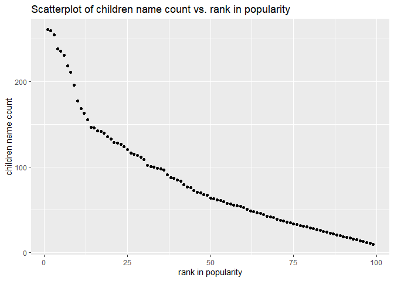

p8105\_hw2\_wz2590
================
Weiheng Zhang

## Problem 1

``` r
library(tidyverse)
```

Read and clean the Mr. Trash Wheel sheet.

``` r
trashWheels_df = readxl::read_excel("./data/Trash-Wheel-Collection-Totals-7-2020-2.xlsx", 
                                    range = "A2:N534") %>%
  janitor::clean_names() %>% # make the naming uniform
  drop_na(dumpster) %>% # drop all the rows that is not dumpster specific
  mutate(sports_balls = round(sports_balls))

trashWheels_df
```

    ## # A tibble: 453 x 14
    ##    dumpster month  year date                weight_tons volume_cubic_yards
    ##       <dbl> <chr> <dbl> <dttm>                    <dbl>              <dbl>
    ##  1        1 May    2014 2014-05-16 00:00:00        4.31                 18
    ##  2        2 May    2014 2014-05-16 00:00:00        2.74                 13
    ##  3        3 May    2014 2014-05-16 00:00:00        3.45                 15
    ##  4        4 May    2014 2014-05-17 00:00:00        3.1                  15
    ##  5        5 May    2014 2014-05-17 00:00:00        4.06                 18
    ##  6        6 May    2014 2014-05-20 00:00:00        2.71                 13
    ##  7        7 May    2014 2014-05-21 00:00:00        1.91                  8
    ##  8        8 May    2014 2014-05-28 00:00:00        3.7                  16
    ##  9        9 June   2014 2014-06-05 00:00:00        2.52                 14
    ## 10       10 June   2014 2014-06-11 00:00:00        3.76                 18
    ## # ... with 443 more rows, and 8 more variables: plastic_bottles <dbl>,
    ## #   polystyrene <dbl>, cigarette_butts <dbl>, glass_bottles <dbl>,
    ## #   grocery_bags <dbl>, chip_bags <dbl>, sports_balls <dbl>,
    ## #   homes_powered <dbl>

Read and clean precipitation data for 2018 and 2019.

``` r
precipitation_18_raw = readxl::read_excel("./data/Trash-Wheel-Collection-Totals-7-2020-2.xlsx", 
                                      sheet = "2018 Precipitation",
                                      range = "A2:B14")
#precipitation_18_raw

precipitation_18_tidy = precipitation_18_raw %>% 
  janitor::clean_names() %>% 
  mutate(year = 2018) %>%
  relocate(year)

precipitation_18_tidy
```

    ## # A tibble: 12 x 3
    ##     year month total
    ##    <dbl> <dbl> <dbl>
    ##  1  2018     1  0.94
    ##  2  2018     2  4.8 
    ##  3  2018     3  2.69
    ##  4  2018     4  4.69
    ##  5  2018     5  9.27
    ##  6  2018     6  4.77
    ##  7  2018     7 10.2 
    ##  8  2018     8  6.45
    ##  9  2018     9 10.5 
    ## 10  2018    10  2.12
    ## 11  2018    11  7.82
    ## 12  2018    12  6.11

``` r
precipitation_19_raw = readxl::read_excel("./data/Trash-Wheel-Collection-Totals-7-2020-2.xlsx", 
                                      sheet = "2019 Precipitation",
                                      range = "A2:B14")
#precipitation_19_raw

precipitation_19_tidy = precipitation_19_raw %>% 
  janitor::clean_names() %>% 
  mutate(year = 2019,) %>%
  relocate(year)

precipitation_19_tidy
```

    ## # A tibble: 12 x 3
    ##     year month total
    ##    <dbl> <dbl> <dbl>
    ##  1  2019     1  3.1 
    ##  2  2019     2  3.64
    ##  3  2019     3  4.47
    ##  4  2019     4  1.46
    ##  5  2019     5  3.58
    ##  6  2019     6  0.42
    ##  7  2019     7  3.85
    ##  8  2019     8  2.39
    ##  9  2019     9  0.16
    ## 10  2019    10  5.45
    ## 11  2019    11  1.86
    ## 12  2019    12  3.57

Combine the 2018 and 2019 data, and convert month to a character
variable

``` r
precipitation_comb = 
  bind_rows(precipitation_18_tidy, precipitation_19_tidy) %>%
  mutate(month = month.name[month])

precipitation_comb
```

    ## # A tibble: 24 x 3
    ##     year month     total
    ##    <dbl> <chr>     <dbl>
    ##  1  2018 January    0.94
    ##  2  2018 February   4.8 
    ##  3  2018 March      2.69
    ##  4  2018 April      4.69
    ##  5  2018 May        9.27
    ##  6  2018 June       4.77
    ##  7  2018 July      10.2 
    ##  8  2018 August     6.45
    ##  9  2018 September 10.5 
    ## 10  2018 October    2.12
    ## # ... with 14 more rows

Calculate the median number of sports balls in a dumpster in 2019

``` r
sportsBalls_2019 = trashWheels_df %>% 
  filter(year == 2019) %>% 
  select(sports_balls)

med_sportsBalls_2019 = median(sportsBalls_2019[[1]])

med_sportsBalls_2019
```

    ## [1] 9

Mr. Trash Wheel is a water-wheel vessel that removes trash from the
Inner Harbor in Baltimore, Maryland. The trashWheels\_df data frame
contains these information that is specific to each dumpster. There are
453 observations in the trashWheels\_df data frame, each observation has
14 variables.

The precipitation\_18\_tidy data frame contains the precipitation(in)
for each month in year 2018. There are 12 observations in this data
frame, since a year has 12 months.

The precipitation\_19\_tidy data frame contains the precipitation(in)
for each month in year 2019. There are 12 observations in this data
frame, since a year has 12 months.

The precipitation\_comb data frame contains the precipitation(in) on
each month from Jan 2018 to Dec 2019. There are 24 observations in this
data frame, since two years have 24 months.

The key variables are `month` and `year`, because these variables exist
in all data frames above and can be used to combine them.

The total precipitation in 2018 is 70.33 inches. The median number of
sports balls in a dumpster in 2019 is 9 balls.

## Problem 2

First, clean the data in pols-month.csv

``` r
pols_month_df_raw = read_csv("./data/fivethirtyeight_datasets/pols-month.csv")

#pols_month_df_raw
 
pol_month_df = pols_month_df_raw %>%       
  janitor::clean_names() %>% 
  separate(mon, into = c("year", "month", "day"), convert = T) %>% 
  mutate(month = month.name[month], 
         president = ifelse(prez_gop >= 1 & prez_dem == 0, "gop", "dem")) %>% 
  select(-c(day, prez_gop, prez_dem))
  
pol_month_df
```

    ## # A tibble: 822 x 9
    ##     year month     gov_gop sen_gop rep_gop gov_dem sen_dem rep_dem president
    ##    <int> <chr>       <dbl>   <dbl>   <dbl>   <dbl>   <dbl>   <dbl> <chr>    
    ##  1  1947 January        23      51     253      23      45     198 dem      
    ##  2  1947 February       23      51     253      23      45     198 dem      
    ##  3  1947 March          23      51     253      23      45     198 dem      
    ##  4  1947 April          23      51     253      23      45     198 dem      
    ##  5  1947 May            23      51     253      23      45     198 dem      
    ##  6  1947 June           23      51     253      23      45     198 dem      
    ##  7  1947 July           23      51     253      23      45     198 dem      
    ##  8  1947 August         23      51     253      23      45     198 dem      
    ##  9  1947 September      23      51     253      23      45     198 dem      
    ## 10  1947 October        23      51     253      23      45     198 dem      
    ## # ... with 812 more rows

Second, clean the data in snp.csv using a similar process to the above.
The format of the data before and after the year 2020 are different.
Thus I need to tidy the data seperately.

``` r
snp_df_raw_new = read_csv("./data/fivethirtyeight_datasets/snp.csv", n_max = 175)

#snp_df_raw_old
 
snp_df_new = snp_df_raw_new %>%       
  janitor::clean_names() %>% 
  separate(date, into = c("year", "month", "day"), sep = "/") %>% 
  mutate(year = as.integer(year),
         month = as.integer(month),
         day = as.integer(day)) %>% 
  arrange(year, month, day) %>% 
  mutate(month = month.name[as.numeric(month)], 
         year = year + 2000) 
  
#snp_df_new
```

``` r
raw_colNames = read_csv("./data/fivethirtyeight_datasets/snp.csv", n_max = 0) %>% 
  names()

snp_df_raw_old = read_csv("./data/fivethirtyeight_datasets/snp.csv", skip = 176, col_names = raw_colNames)

#snp_df_raw_old
 
snp_df_old = snp_df_raw_old %>%       
  janitor::clean_names() %>% 
  separate(date, into = c("month", "day", "year"), sep = "/") %>% 
  mutate(year = as.integer(year),
         month = as.integer(month),
         day = as.integer(day)) %>% 
  mutate(month = month.name[as.numeric(month)], 
         year = ifelse(year == 00, year + 2000, year + 1900)) %>% 
  relocate(year, month, day, close) %>% 
  arrange(year, month, day)
  
#snp_df_old


snp_df = rbind(snp_df_old, snp_df_new) %>% 
  select(-day)
snp_df
```

    ## # A tibble: 787 x 3
    ##     year month    close
    ##    <dbl> <chr>    <dbl>
    ##  1  1950 April     18.0
    ##  2  1950 August    18.4
    ##  3  1950 December  20.4
    ##  4  1950 February  17.2
    ##  5  1950 January   17.0
    ##  6  1950 July      17.8
    ##  7  1950 June      17.7
    ##  8  1950 March     17.3
    ##  9  1950 May       18.8
    ## 10  1950 November  19.5
    ## # ... with 777 more rows

Tidy the unemployment data so that it can be merged with the previous
datasets.

``` r
unemployment_df_raw = read.csv("./data/fivethirtyeight_datasets/unemployment.csv") 

#unemployment_df_raw

unemployment_df = unemployment_df_raw %>%
  pivot_longer(Jan:Dec, names_to = "month", values_to = "unemployment_percentage") %>%
  mutate(month = match(month, month.abb), month = month.name[month]) %>% 
  janitor::clean_names()

unemployment_df
```

    ## # A tibble: 816 x 3
    ##     year month     unemployment_percentage
    ##    <int> <chr>                       <dbl>
    ##  1  1948 January                       3.4
    ##  2  1948 February                      3.8
    ##  3  1948 March                         4  
    ##  4  1948 April                         3.9
    ##  5  1948 May                           3.5
    ##  6  1948 June                          3.6
    ##  7  1948 July                          3.6
    ##  8  1948 August                        3.9
    ##  9  1948 September                     3.8
    ## 10  1948 October                       3.7
    ## # ... with 806 more rows

``` r
merged_df = left_join(pol_month_df, snp_df, unemployment_df, by = c("year", "month"))

year_range = merged_df %>% 
  select(year) %>% 
  range()

merged_df
```

    ## # A tibble: 960 x 10
    ##     year month   gov_gop sen_gop rep_gop gov_dem sen_dem rep_dem president close
    ##    <dbl> <chr>     <dbl>   <dbl>   <dbl>   <dbl>   <dbl>   <dbl> <chr>     <dbl>
    ##  1  1947 January      23      51     253      23      45     198 dem          NA
    ##  2  1947 Februa~      23      51     253      23      45     198 dem          NA
    ##  3  1947 March        23      51     253      23      45     198 dem          NA
    ##  4  1947 April        23      51     253      23      45     198 dem          NA
    ##  5  1947 May          23      51     253      23      45     198 dem          NA
    ##  6  1947 June         23      51     253      23      45     198 dem          NA
    ##  7  1947 July         23      51     253      23      45     198 dem          NA
    ##  8  1947 August       23      51     253      23      45     198 dem          NA
    ##  9  1947 Septem~      23      51     253      23      45     198 dem          NA
    ## 10  1947 October      23      51     253      23      45     198 dem          NA
    ## # ... with 950 more rows

``` r
year_range
```

    ## [1] 1947 2015

Describe the data: The pol\_month\_df data frame describes the number of
national politicians who are democratic or republican at any given time.
It has 822 observations, with each observations having 9 variables.  
The snp\_df data frame describes the Standard & Poor’s stock market
index (S&P), often used as a representative measure of stock market as a
whole. It has 787 observations, with each observations having 3
variables.  
The unemployment\_df data frame contains the unemployment percentage for
each month from January 1948 to December 2015. It has 816 observations,
with each observations having 3 variables.  
The merged\_df data frame is a combination of the previous three with
key variables `year` and `month`. It has 960 observations, with each
observations having 10 variables. The year ranges from 1947 to 2015.

## Problem 3

Load and tidy the data

``` r
baby_names_df = read_csv("./data/Popular_Baby_Names.csv") %>% 
  janitor::clean_names() %>%
  #view %>% 
  mutate(ethnicity = recode(ethnicity, 
                            "ASIAN AND PACI" = "ASIAN AND PACIFIC ISLANDER",
                            "BLACK NON HISP" = "BLACK NON HISPANIC",
                            "WHITE NON HISP" = "WHITE NON HISPANIC"),
         childs_first_name = str_to_sentence(childs_first_name)) %>% 
  dplyr::distinct() %>% 
  
  view
```

Produce a well-structured, reader-friendly table showing the rank in
popularity of the name “Olivia” as a female baby name over time.

``` r
Olivia_rankTable = baby_names_df %>% 
  filter(childs_first_name == "Olivia", gender == "FEMALE") %>%
  pivot_wider(names_from = "year_of_birth",
              values_from = "rank",
              id_cols = ethnicity
    )

Olivia_rankTable
```

    ## # A tibble: 4 x 7
    ##   ethnicity                  `2016` `2015` `2014` `2013` `2012` `2011`
    ##   <chr>                       <dbl>  <dbl>  <dbl>  <dbl>  <dbl>  <dbl>
    ## 1 ASIAN AND PACIFIC ISLANDER      1      1      1      3      3      4
    ## 2 BLACK NON HISPANIC              8      4      8      6      8     10
    ## 3 HISPANIC                       13     16     16     22     22     18
    ## 4 WHITE NON HISPANIC              1      1      1      1      4      2

Produce a similar table showing the most popular name among male
children over time.

``` r
boy_nameRank = baby_names_df %>% 
  filter(gender == "MALE", rank == 1) %>% 
  select(-count, -rank, -gender) %>% 
  pivot_wider(
    names_from = "year_of_birth",
    values_from = "childs_first_name"
    )
  
boy_nameRank
```

    ## # A tibble: 4 x 7
    ##   ethnicity                  `2016` `2015` `2014` `2013` `2012` `2011` 
    ##   <chr>                      <chr>  <chr>  <chr>  <chr>  <chr>  <chr>  
    ## 1 ASIAN AND PACIFIC ISLANDER Ethan  Jayden Jayden Jayden Ryan   Ethan  
    ## 2 BLACK NON HISPANIC         Noah   Noah   Ethan  Ethan  Jayden Jayden 
    ## 3 HISPANIC                   Liam   Liam   Liam   Jayden Jayden Jayden 
    ## 4 WHITE NON HISPANIC         Joseph David  Joseph David  Joseph Michael

For male, white non-hispanic children born in 2016, produce a scatter
plot showing the number of children with a name (y axis) against the
rank in popularity of that name (x axis).

``` r
name_vs_rank_16 = baby_names_df %>% 
  filter(year_of_birth == 2016,
         gender == "MALE",
         ethnicity == "WHITE NON HISPANIC",
         ) %>%
  ggplot(aes(x = rank, y = count)) + geom_point() + 
  xlab("rank in popularity") + ylab("children name count") +
  labs(title = "Scatterplot of children name count vs. rank in popularity")

name_vs_rank_16
```

<!-- -->
