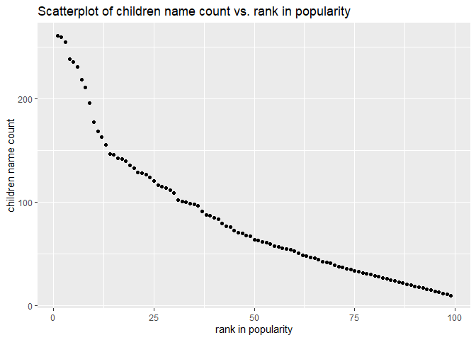

p8105\_hw2\_wz2590
================
Weiheng Zhang

### Problem 1

``` r
library(tidyverse)
```

Read and clean the Mr. Trash Wheel sheet.

``` r
trashWheels_df = readxl::read_excel("./data/Trash-Wheel-Collection-Totals-8-6-19.xlsx", range = "A2:N408") %>%
  janitor::clean_names() %>% # make the naming uniform
  drop_na(dumpster) %>% # drop all the rows that is not dumpster specific
  mutate (
    sports_balls = round(sports_balls) %>% 
      as.integer()
  )
```

    ## Warning in FUN(X[[i]], ...): strings not representable in native encoding will
    ## be translated to UTF-8

    ## Warning in FUN(X[[i]], ...): unable to translate '<U+00C4>' to native encoding

    ## Warning in FUN(X[[i]], ...): unable to translate '<U+00D6>' to native encoding

    ## Warning in FUN(X[[i]], ...): unable to translate '<U+00E4>' to native encoding

    ## Warning in FUN(X[[i]], ...): unable to translate '<U+00F6>' to native encoding

    ## Warning in FUN(X[[i]], ...): unable to translate '<U+00DF>' to native encoding

    ## Warning in FUN(X[[i]], ...): unable to translate '<U+00C6>' to native encoding

    ## Warning in FUN(X[[i]], ...): unable to translate '<U+00E6>' to native encoding

    ## Warning in FUN(X[[i]], ...): unable to translate '<U+00D8>' to native encoding

    ## Warning in FUN(X[[i]], ...): unable to translate '<U+00F8>' to native encoding

    ## Warning in FUN(X[[i]], ...): unable to translate '<U+00C5>' to native encoding

    ## Warning in FUN(X[[i]], ...): unable to translate '<U+00E5>' to native encoding

``` r
trashWheels_df
```

    ## # A tibble: 344 x 14
    ##    dumpster month  year date                weight_tons volume_cubic_yards
    ##       <dbl> <chr> <dbl> <dttm>                    <dbl>              <dbl>
    ##  1        1 May    2014 2014-05-16 00:00:00        4.31                 18
    ##  2        2 May    2014 2014-05-16 00:00:00        2.74                 13
    ##  3        3 May    2014 2014-05-16 00:00:00        3.45                 15
    ##  4        4 May    2014 2014-05-17 00:00:00        3.1                  15
    ##  5        5 May    2014 2014-05-17 00:00:00        4.06                 18
    ##  6        6 May    2014 2014-05-20 00:00:00        2.71                 13
    ##  7        7 May    2014 2014-05-21 00:00:00        1.91                  8
    ##  8        8 May    2014 2014-05-28 00:00:00        3.7                  16
    ##  9        9 June   2014 2014-06-05 00:00:00        2.52                 14
    ## 10       10 June   2014 2014-06-11 00:00:00        3.76                 18
    ## # ... with 334 more rows, and 8 more variables: plastic_bottles <dbl>,
    ## #   polystyrene <dbl>, cigarette_butts <dbl>, glass_bottles <dbl>,
    ## #   grocery_bags <dbl>, chip_bags <dbl>, sports_balls <int>,
    ## #   homes_powered <dbl>

Read and clean precipitation data for 2018 and 2019.

``` r
precipitation_18_raw = readxl::read_excel("./data/Trash-Wheel-Collection-Totals-8-6-19.xlsx", 
                                      sheet = "2018 Precipitation",
                                      skip = 1)
precipitation_18_raw
```

    ## # A tibble: 13 x 2
    ##    Month Total
    ##    <dbl> <dbl>
    ##  1     1  0.94
    ##  2     2  4.8 
    ##  3     3  2.69
    ##  4     4  4.69
    ##  5     5  9.27
    ##  6     6  4.77
    ##  7     7 10.2 
    ##  8     8  6.45
    ##  9     9 10.5 
    ## 10    10  2.12
    ## 11    11  7.82
    ## 12    12  6.11
    ## 13    NA 70.3

``` r
precipitation_18_tidy = precipitation_18_raw %>% 
  drop_na(Month, Total) %>% 
  mutate (year = 2018) %>%
  subset (select = c(3,1,2))

precipitation_18_tidy
```

    ## # A tibble: 12 x 3
    ##     year Month Total
    ##    <dbl> <dbl> <dbl>
    ##  1  2018     1  0.94
    ##  2  2018     2  4.8 
    ##  3  2018     3  2.69
    ##  4  2018     4  4.69
    ##  5  2018     5  9.27
    ##  6  2018     6  4.77
    ##  7  2018     7 10.2 
    ##  8  2018     8  6.45
    ##  9  2018     9 10.5 
    ## 10  2018    10  2.12
    ## 11  2018    11  7.82
    ## 12  2018    12  6.11

``` r
precipitation_19_raw = readxl::read_excel("./data/Trash-Wheel-Collection-Totals-8-6-19.xlsx", 
                                      sheet = "2019 Precipitation",
                                      skip = 1)
precipitation_19_raw
```

    ## # A tibble: 13 x 2
    ##    Month Total
    ##    <dbl> <dbl>
    ##  1     1  3.1 
    ##  2     2  3.64
    ##  3     3  4.47
    ##  4     4  1.46
    ##  5     5  3.58
    ##  6     6  0.42
    ##  7     7 NA   
    ##  8     8 NA   
    ##  9     9 NA   
    ## 10    10 NA   
    ## 11    11 NA   
    ## 12    12 NA   
    ## 13    NA 16.7

``` r
precipitation_19_tidy = precipitation_19_raw %>% 
  drop_na(Month, Total) %>% 
  mutate (year = 2019,) %>%
  subset (select = c(3,1,2))

precipitation_19_tidy
```

    ## # A tibble: 6 x 3
    ##    year Month Total
    ##   <dbl> <dbl> <dbl>
    ## 1  2019     1  3.1 
    ## 2  2019     2  3.64
    ## 3  2019     3  4.47
    ## 4  2019     4  1.46
    ## 5  2019     5  3.58
    ## 6  2019     6  0.42

Combine the 2018 and 2019 data, and convert month to a character
variable

``` r
precipitation_comb = 
  bind_rows(precipitation_18_tidy, precipitation_19_tidy) %>%
  mutate (Month = month.name[Month])

precipitation_comb
```

    ## # A tibble: 18 x 3
    ##     year Month     Total
    ##    <dbl> <chr>     <dbl>
    ##  1  2018 January    0.94
    ##  2  2018 February   4.8 
    ##  3  2018 March      2.69
    ##  4  2018 April      4.69
    ##  5  2018 May        9.27
    ##  6  2018 June       4.77
    ##  7  2018 July      10.2 
    ##  8  2018 August     6.45
    ##  9  2018 September 10.5 
    ## 10  2018 October    2.12
    ## 11  2018 November   7.82
    ## 12  2018 December   6.11
    ## 13  2019 January    3.1 
    ## 14  2019 February   3.64
    ## 15  2019 March      4.47
    ## 16  2019 April      1.46
    ## 17  2019 May        3.58
    ## 18  2019 June       0.42

``` r
sportsBalls_2017 = trashWheels_df %>% 
  filter(year == 2017) %>% 
  select(sports_balls)

med_sportsBalls_2017 = median(sportsBalls_2017[[1]])

med_sportsBalls_2017
```

    ## [1] 8

Mr. Trash Wheel is “a water-wheel vessel that removes trash from the
Inner Harbor in Baltimore, Maryland. This dataset contains these
information that is specific to each dumpster: month, year, date,
weight\_tons, volume\_cubic\_yards, plastic\_bottles, polystyrene,
cigarette\_butts, glass\_bottles, grocery\_bags, chip\_bags,
sports\_balls, homes\_powered.

The precipitation\_comb data frame contains the precipitation(in) on
each month from Jan 2018 to Jun 2019.

The total precipitation in 2018 is 70.33 inches. The median number of
sports balls in a dumpster in 2017 is 8.

### Problem 2

First, clean the data in pols-month.csv

``` r
pols_month_df_raw = read_csv("./data/fivethirtyeight_datasets/pols-month.csv")
```

    ## Rows: 822 Columns: 9

    ## -- Column specification --------------------------------------------------------
    ## Delimiter: ","
    ## dbl  (8): prez_gop, gov_gop, sen_gop, rep_gop, prez_dem, gov_dem, sen_dem, r...
    ## date (1): mon

    ## 
    ## i Use `spec()` to retrieve the full column specification for this data.
    ## i Specify the column types or set `show_col_types = FALSE` to quiet this message.

``` r
#pols_month_df_raw
 
pol_month_df = pols_month_df_raw %>%       
  janitor::clean_names() %>% 
  separate(mon, into = c("year", "month", "day"), sep = "-", convert = T) %>% 
  mutate(month = month.name[month], 
         president = ifelse(prez_gop >= 1 & prez_dem == 0, "gop", "dem")) %>% 
  select(-c(day, prez_gop, prez_dem))
  
pol_month_df
```

    ## # A tibble: 822 x 9
    ##     year month     gov_gop sen_gop rep_gop gov_dem sen_dem rep_dem president
    ##    <int> <chr>       <dbl>   <dbl>   <dbl>   <dbl>   <dbl>   <dbl> <chr>    
    ##  1  1947 January        23      51     253      23      45     198 dem      
    ##  2  1947 February       23      51     253      23      45     198 dem      
    ##  3  1947 March          23      51     253      23      45     198 dem      
    ##  4  1947 April          23      51     253      23      45     198 dem      
    ##  5  1947 May            23      51     253      23      45     198 dem      
    ##  6  1947 June           23      51     253      23      45     198 dem      
    ##  7  1947 July           23      51     253      23      45     198 dem      
    ##  8  1947 August         23      51     253      23      45     198 dem      
    ##  9  1947 September      23      51     253      23      45     198 dem      
    ## 10  1947 October        23      51     253      23      45     198 dem      
    ## # ... with 812 more rows

Second, clean the data in snp.csv using a similar process to the above.

``` r
snp_df_raw = read_csv("./data/fivethirtyeight_datasets/pols-month.csv")
```

    ## Rows: 822 Columns: 9

    ## -- Column specification --------------------------------------------------------
    ## Delimiter: ","
    ## dbl  (8): prez_gop, gov_gop, sen_gop, rep_gop, prez_dem, gov_dem, sen_dem, r...
    ## date (1): mon

    ## 
    ## i Use `spec()` to retrieve the full column specification for this data.
    ## i Specify the column types or set `show_col_types = FALSE` to quiet this message.

``` r
#snp_df_raw
 
snp_df = snp_df_raw %>%       
  janitor::clean_names() %>% 
  separate(mon, into = c("year", "month", "day"), sep = "-", convert = T) %>% 
  mutate(month = month.name[month], 
         president = ifelse(prez_gop >= 1 & prez_dem == 0, "gop", "dem")) %>% 
  select(-c(day, prez_gop, prez_dem)) %>% 
  arrange(year, month)
  
snp_df
```

    ## # A tibble: 822 x 9
    ##     year month    gov_gop sen_gop rep_gop gov_dem sen_dem rep_dem president
    ##    <int> <chr>      <dbl>   <dbl>   <dbl>   <dbl>   <dbl>   <dbl> <chr>    
    ##  1  1947 April         23      51     253      23      45     198 dem      
    ##  2  1947 August        23      51     253      23      45     198 dem      
    ##  3  1947 December      24      51     253      23      45     198 dem      
    ##  4  1947 February      23      51     253      23      45     198 dem      
    ##  5  1947 January       23      51     253      23      45     198 dem      
    ##  6  1947 July          23      51     253      23      45     198 dem      
    ##  7  1947 June          23      51     253      23      45     198 dem      
    ##  8  1947 March         23      51     253      23      45     198 dem      
    ##  9  1947 May           23      51     253      23      45     198 dem      
    ## 10  1947 November      24      51     253      23      45     198 dem      
    ## # ... with 812 more rows

Tidy the unemployment data so that it can be merged with the previous
datasets.

``` r
unemployment_df_raw = read.csv("./data/fivethirtyeight_datasets/unemployment.csv") 

unemployment_df_raw
```

    ##    Year  Jan  Feb  Mar  Apr  May  Jun Jul Aug  Sep  Oct  Nov  Dec
    ## 1  1948  3.4  3.8  4.0  3.9  3.5  3.6 3.6 3.9  3.8  3.7  3.8  4.0
    ## 2  1949  4.3  4.7  5.0  5.3  6.1  6.2 6.7 6.8  6.6  7.9  6.4  6.6
    ## 3  1950  6.5  6.4  6.3  5.8  5.5  5.4 5.0 4.5  4.4  4.2  4.2  4.3
    ## 4  1951  3.7  3.4  3.4  3.1  3.0  3.2 3.1 3.1  3.3  3.5  3.5  3.1
    ## 5  1952  3.2  3.1  2.9  2.9  3.0  3.0 3.2 3.4  3.1  3.0  2.8  2.7
    ## 6  1953  2.9  2.6  2.6  2.7  2.5  2.5 2.6 2.7  2.9  3.1  3.5  4.5
    ## 7  1954  4.9  5.2  5.7  5.9  5.9  5.6 5.8 6.0  6.1  5.7  5.3  5.0
    ## 8  1955  4.9  4.7  4.6  4.7  4.3  4.2 4.0 4.2  4.1  4.3  4.2  4.2
    ## 9  1956  4.0  3.9  4.2  4.0  4.3  4.3 4.4 4.1  3.9  3.9  4.3  4.2
    ## 10 1957  4.2  3.9  3.7  3.9  4.1  4.3 4.2 4.1  4.4  4.5  5.1  5.2
    ## 11 1958  5.8  6.4  6.7  7.4  7.4  7.3 7.5 7.4  7.1  6.7  6.2  6.2
    ## 12 1959  6.0  5.9  5.6  5.2  5.1  5.0 5.1 5.2  5.5  5.7  5.8  5.3
    ## 13 1960  5.2  4.8  5.4  5.2  5.1  5.4 5.5 5.6  5.5  6.1  6.1  6.6
    ## 14 1961  6.6  6.9  6.9  7.0  7.1  6.9 7.0 6.6  6.7  6.5  6.1  6.0
    ## 15 1962  5.8  5.5  5.6  5.6  5.5  5.5 5.4 5.7  5.6  5.4  5.7  5.5
    ## 16 1963  5.7  5.9  5.7  5.7  5.9  5.6 5.6 5.4  5.5  5.5  5.7  5.5
    ## 17 1964  5.6  5.4  5.4  5.3  5.1  5.2 4.9 5.0  5.1  5.1  4.8  5.0
    ## 18 1965  4.9  5.1  4.7  4.8  4.6  4.6 4.4 4.4  4.3  4.2  4.1  4.0
    ## 19 1966  4.0  3.8  3.8  3.8  3.9  3.8 3.8 3.8  3.7  3.7  3.6  3.8
    ## 20 1967  3.9  3.8  3.8  3.8  3.8  3.9 3.8 3.8  3.8  4.0  3.9  3.8
    ## 21 1968  3.7  3.8  3.7  3.5  3.5  3.7 3.7 3.5  3.4  3.4  3.4  3.4
    ## 22 1969  3.4  3.4  3.4  3.4  3.4  3.5 3.5 3.5  3.7  3.7  3.5  3.5
    ## 23 1970  3.9  4.2  4.4  4.6  4.8  4.9 5.0 5.1  5.4  5.5  5.9  6.1
    ## 24 1971  5.9  5.9  6.0  5.9  5.9  5.9 6.0 6.1  6.0  5.8  6.0  6.0
    ## 25 1972  5.8  5.7  5.8  5.7  5.7  5.7 5.6 5.6  5.5  5.6  5.3  5.2
    ## 26 1973  4.9  5.0  4.9  5.0  4.9  4.9 4.8 4.8  4.8  4.6  4.8  4.9
    ## 27 1974  5.1  5.2  5.1  5.1  5.1  5.4 5.5 5.5  5.9  6.0  6.6  7.2
    ## 28 1975  8.1  8.1  8.6  8.8  9.0  8.8 8.6 8.4  8.4  8.4  8.3  8.2
    ## 29 1976  7.9  7.7  7.6  7.7  7.4  7.6 7.8 7.8  7.6  7.7  7.8  7.8
    ## 30 1977  7.5  7.6  7.4  7.2  7.0  7.2 6.9 7.0  6.8  6.8  6.8  6.4
    ## 31 1978  6.4  6.3  6.3  6.1  6.0  5.9 6.2 5.9  6.0  5.8  5.9  6.0
    ## 32 1979  5.9  5.9  5.8  5.8  5.6  5.7 5.7 6.0  5.9  6.0  5.9  6.0
    ## 33 1980  6.3  6.3  6.3  6.9  7.5  7.6 7.8 7.7  7.5  7.5  7.5  7.2
    ## 34 1981  7.5  7.4  7.4  7.2  7.5  7.5 7.2 7.4  7.6  7.9  8.3  8.5
    ## 35 1982  8.6  8.9  9.0  9.3  9.4  9.6 9.8 9.8 10.1 10.4 10.8 10.8
    ## 36 1983 10.4 10.4 10.3 10.2 10.1 10.1 9.4 9.5  9.2  8.8  8.5  8.3
    ## 37 1984  8.0  7.8  7.8  7.7  7.4  7.2 7.5 7.5  7.3  7.4  7.2  7.3
    ## 38 1985  7.3  7.2  7.2  7.3  7.2  7.4 7.4 7.1  7.1  7.1  7.0  7.0
    ## 39 1986  6.7  7.2  7.2  7.1  7.2  7.2 7.0 6.9  7.0  7.0  6.9  6.6
    ## 40 1987  6.6  6.6  6.6  6.3  6.3  6.2 6.1 6.0  5.9  6.0  5.8  5.7
    ## 41 1988  5.7  5.7  5.7  5.4  5.6  5.4 5.4 5.6  5.4  5.4  5.3  5.3
    ## 42 1989  5.4  5.2  5.0  5.2  5.2  5.3 5.2 5.2  5.3  5.3  5.4  5.4
    ## 43 1990  5.4  5.3  5.2  5.4  5.4  5.2 5.5 5.7  5.9  5.9  6.2  6.3
    ## 44 1991  6.4  6.6  6.8  6.7  6.9  6.9 6.8 6.9  6.9  7.0  7.0  7.3
    ## 45 1992  7.3  7.4  7.4  7.4  7.6  7.8 7.7 7.6  7.6  7.3  7.4  7.4
    ## 46 1993  7.3  7.1  7.0  7.1  7.1  7.0 6.9 6.8  6.7  6.8  6.6  6.5
    ## 47 1994  6.6  6.6  6.5  6.4  6.1  6.1 6.1 6.0  5.9  5.8  5.6  5.5
    ## 48 1995  5.6  5.4  5.4  5.8  5.6  5.6 5.7 5.7  5.6  5.5  5.6  5.6
    ## 49 1996  5.6  5.5  5.5  5.6  5.6  5.3 5.5 5.1  5.2  5.2  5.4  5.4
    ## 50 1997  5.3  5.2  5.2  5.1  4.9  5.0 4.9 4.8  4.9  4.7  4.6  4.7
    ## 51 1998  4.6  4.6  4.7  4.3  4.4  4.5 4.5 4.5  4.6  4.5  4.4  4.4
    ## 52 1999  4.3  4.4  4.2  4.3  4.2  4.3 4.3 4.2  4.2  4.1  4.1  4.0
    ## 53 2000  4.0  4.1  4.0  3.8  4.0  4.0 4.0 4.1  3.9  3.9  3.9  3.9
    ## 54 2001  4.2  4.2  4.3  4.4  4.3  4.5 4.6 4.9  5.0  5.3  5.5  5.7
    ## 55 2002  5.7  5.7  5.7  5.9  5.8  5.8 5.8 5.7  5.7  5.7  5.9  6.0
    ## 56 2003  5.8  5.9  5.9  6.0  6.1  6.3 6.2 6.1  6.1  6.0  5.8  5.7
    ## 57 2004  5.7  5.6  5.8  5.6  5.6  5.6 5.5 5.4  5.4  5.5  5.4  5.4
    ## 58 2005  5.3  5.4  5.2  5.2  5.1  5.0 5.0 4.9  5.0  5.0  5.0  4.9
    ## 59 2006  4.7  4.8  4.7  4.7  4.6  4.6 4.7 4.7  4.5  4.4  4.5  4.4
    ## 60 2007  4.6  4.5  4.4  4.5  4.4  4.6 4.7 4.6  4.7  4.7  4.7  5.0
    ## 61 2008  5.0  4.9  5.1  5.0  5.4  5.6 5.8 6.1  6.1  6.5  6.8  7.3
    ## 62 2009  7.8  8.3  8.7  9.0  9.4  9.5 9.5 9.6  9.8 10.0  9.9  9.9
    ## 63 2010  9.8  9.8  9.9  9.9  9.6  9.4 9.4 9.5  9.5  9.4  9.8  9.3
    ## 64 2011  9.2  9.0  9.0  9.1  9.0  9.1 9.0 9.0  9.0  8.8  8.6  8.5
    ## 65 2012  8.3  8.3  8.2  8.2  8.2  8.2 8.2 8.0  7.8  7.8  7.7  7.9
    ## 66 2013  8.0  7.7  7.5  7.6  7.5  7.5 7.3 7.2  7.2  7.2  7.0  6.7
    ## 67 2014  6.6  6.7  6.6  6.2  6.3  6.1 6.2 6.1  5.9  5.7  5.8  5.6
    ## 68 2015  5.7  5.5  5.5  5.4  5.5  5.3  NA  NA   NA   NA   NA   NA

``` r
unemployment_df = unemployment_df_raw %>%
  pivot_longer(Jan:Dec, names_to = "month", values_to = "unemployment_percentage") %>%
  mutate(month = match(month, month.abb), month = month.name[month]) %>% 
  janitor::clean_names()

unemployment_df
```

    ## # A tibble: 816 x 3
    ##     year month     unemployment_percentage
    ##    <int> <chr>                       <dbl>
    ##  1  1948 January                       3.4
    ##  2  1948 February                      3.8
    ##  3  1948 March                         4  
    ##  4  1948 April                         3.9
    ##  5  1948 May                           3.5
    ##  6  1948 June                          3.6
    ##  7  1948 July                          3.6
    ##  8  1948 August                        3.9
    ##  9  1948 September                     3.8
    ## 10  1948 October                       3.7
    ## # ... with 806 more rows

``` r
merged_df = left_join(pol_month_df, snp_df, by = c("year", "month")) %>% 
  left_join(unemployment_df, by = c("year", "month")) %>% 
  janitor::clean_names()

year_range = merged_df %>% 
  select(year) %>% 
  range()

merged_df
```

    ## # A tibble: 822 x 17
    ##     year month     gov_gop_x sen_gop_x rep_gop_x gov_dem_x sen_dem_x rep_dem_x
    ##    <int> <chr>         <dbl>     <dbl>     <dbl>     <dbl>     <dbl>     <dbl>
    ##  1  1947 January          23        51       253        23        45       198
    ##  2  1947 February         23        51       253        23        45       198
    ##  3  1947 March            23        51       253        23        45       198
    ##  4  1947 April            23        51       253        23        45       198
    ##  5  1947 May              23        51       253        23        45       198
    ##  6  1947 June             23        51       253        23        45       198
    ##  7  1947 July             23        51       253        23        45       198
    ##  8  1947 August           23        51       253        23        45       198
    ##  9  1947 September        23        51       253        23        45       198
    ## 10  1947 October          23        51       253        23        45       198
    ## # ... with 812 more rows, and 9 more variables: president_x <chr>,
    ## #   gov_gop_y <dbl>, sen_gop_y <dbl>, rep_gop_y <dbl>, gov_dem_y <dbl>,
    ## #   sen_dem_y <dbl>, rep_dem_y <dbl>, president_y <chr>,
    ## #   unemployment_percentage <dbl>

``` r
year_range
```

    ## [1] 1947 2015

Describe the data:

### Problem 3

Load and tidy the data

``` r
baby_names_df = read_csv("./data/Popular_Baby_Names.csv") %>% 
  janitor::clean_names() %>%
  #view %>% 
  mutate(ethnicity = recode(ethnicity, 
                            "ASIAN AND PACI" = "ASIAN AND PACIFIC ISLANDER",
                            "BLACK NON HISP" = "BLACK NON HISPANIC",
                            "WHITE NON HISP" = "WHITE NON HISPANIC"),
         childs_first_name = str_to_sentence(childs_first_name)) %>% 
  dplyr::distinct() %>% 
  
  view
```

    ## Rows: 19418 Columns: 6

    ## -- Column specification --------------------------------------------------------
    ## Delimiter: ","
    ## chr (3): Gender, Ethnicity, Child's First Name
    ## dbl (3): Year of Birth, Count, Rank

    ## 
    ## i Use `spec()` to retrieve the full column specification for this data.
    ## i Specify the column types or set `show_col_types = FALSE` to quiet this message.

Produce a well-structured, reader-friendly table showing the rank in
popularity of the name “Olivia” as a female baby name over time.

``` r
Olivia_rankTable = baby_names_df %>% 
  filter(childs_first_name == "Olivia", gender == "FEMALE") %>%
  pivot_wider(names_from = "year_of_birth",
              values_from = "rank",
              id_cols = ethnicity
    )

Olivia_rankTable
```

    ## # A tibble: 4 x 7
    ##   ethnicity                  `2016` `2015` `2014` `2013` `2012` `2011`
    ##   <chr>                       <dbl>  <dbl>  <dbl>  <dbl>  <dbl>  <dbl>
    ## 1 ASIAN AND PACIFIC ISLANDER      1      1      1      3      3      4
    ## 2 BLACK NON HISPANIC              8      4      8      6      8     10
    ## 3 HISPANIC                       13     16     16     22     22     18
    ## 4 WHITE NON HISPANIC              1      1      1      1      4      2

Produce a similar table showing the most popular name among male
children over time.

``` r
boy_nameRank = baby_names_df %>% 
  filter(gender == "MALE", rank == 1) %>% 
  select(-count, -rank, -gender) %>% 
  pivot_wider(
    names_from = "year_of_birth",
    values_from = "childs_first_name"
    )
  
boy_nameRank
```

    ## # A tibble: 4 x 7
    ##   ethnicity                  `2016` `2015` `2014` `2013` `2012` `2011` 
    ##   <chr>                      <chr>  <chr>  <chr>  <chr>  <chr>  <chr>  
    ## 1 ASIAN AND PACIFIC ISLANDER Ethan  Jayden Jayden Jayden Ryan   Ethan  
    ## 2 BLACK NON HISPANIC         Noah   Noah   Ethan  Ethan  Jayden Jayden 
    ## 3 HISPANIC                   Liam   Liam   Liam   Jayden Jayden Jayden 
    ## 4 WHITE NON HISPANIC         Joseph David  Joseph David  Joseph Michael

For male, white non-hispanic children born in 2016, produce a scatter
plot showing the number of children with a name (y axis) against the
rank in popularity of that name (x axis).

``` r
name_vs_rank_16 = baby_names_df %>% 
  filter(year_of_birth == 2016,
         gender == "MALE",
         ethnicity == "WHITE NON HISPANIC",
         ) %>%
  ggplot(aes(x = rank, y = count)) + geom_point() + 
  xlab("rank in popularity") + ylab("children name count") +
  labs(title = "Scatterplot of children name count vs. rank in popularity")

name_vs_rank_16
```

<!-- -->
